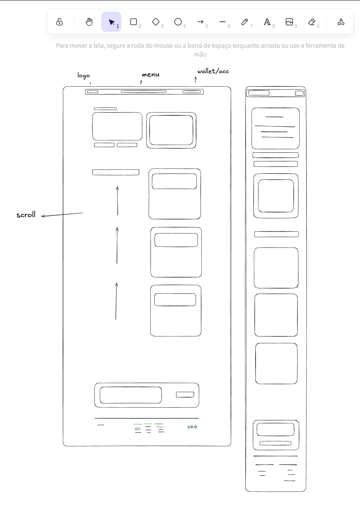

# DeTeam-8 Frontend

Este repositório contém o código frontend do projeto DeTeam-8, uma aplicação web desenvolvida com Next.js e TypeScript.

## Design Inicial

O projeto começou com rascunhos simples para definir a estrutura básica da interface:



Este wireframe inicial estabeleceu os principais elementos da interface:

- Cabeçalho com logo e menu de navegação
- Área principal com conteúdo rolável
- Painel lateral para wallet/conta do usuário
- Footer com links e informações de contato

## Arquitetura

O projeto utiliza as seguintes tecnologias e padrões:

### Stack Tecnológico

- **Framework**: Next.js 14 (App Router)
- **Linguagem**: TypeScript
- **Estilização**: Tailwind CSS
- **Fontes**: Geist Sans e Geist Mono
- **Ícones**: Lucide React

### Estrutura de Diretórios

```
/app
  /components      # Componentes reutilizáveis
    /animations    # Animações e transições
    /general       # Componentes gerais
    /layout        # Componentes de layout
    /ui           # Componentes de interface
  /lib            # Utilitários e funções auxiliares
  globals.css     # Estilos globais
  layout.tsx      # Layout principal
  page.tsx        # Página inicial
/public           # Arquivos estáticos
  /images         # Imagens e assets
```

## Configuração do Ambiente

1. Clone o repositório:

```bash
git clone [url-do-repositorio]
cd frontend
```

2. Instale as dependências:

```bash
pnpm install
```

3. Inicie o servidor de desenvolvimento:

```bash
pnpm dev
```

## Scripts Disponíveis

- `pnpm dev` - Inicia o servidor de desenvolvimento com Turbopack
- `pnpm build` - Gera a build de produção
- `pnpm start` - Inicia o servidor de produção
- `pnpm lint` - Executa a verificação de linting

## Padrões de Código

### Componentes

- Utilize TypeScript para todos os componentes
- Siga o padrão de composição do Radix UI
- Implemente animações com Framer Motion
- Estilize usando Tailwind CSS e class-variance-authority

### Convenções de Nomenclatura

- Componentes: PascalCase (ex: Button.tsx)
- Utilitários: camelCase (ex: utils.ts)
- Constantes: UPPER_SNAKE_CASE

## Contribuição

1. Crie uma branch para sua feature:

```bash
git checkout -b feature/nome-da-feature
```

2. Faça commit das alterações:

```bash
git commit -m "feat: descrição da alteração"
```

3. Envie para o repositório:

```bash
git push origin feature/nome-da-feature
```

4. Abra um Pull Request com uma descrição clara das alterações
